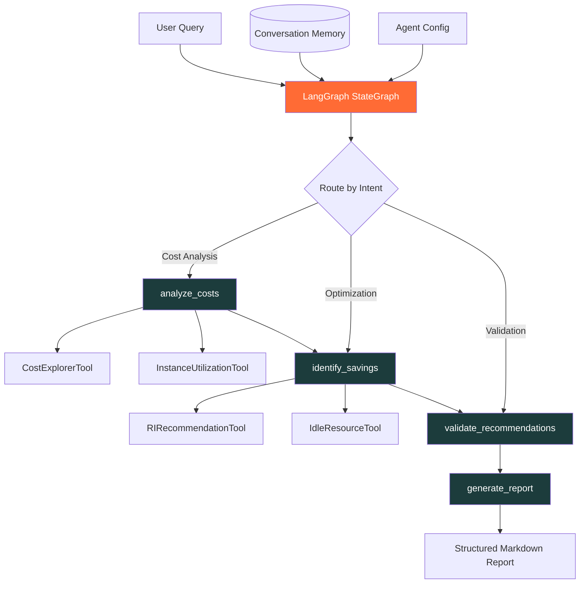

# ☁️ Cloud Cost Intelligence Agent

[](https://python.org)
[](https://langchain.com)
[](https://langchain-ai.github.io/langgraph/)
[](https://aws.amazon.com)
[](https://streamlit.io)
[](LICENSE)

> **An AI-powered agent built with LangChain and LangGraph that analyzes cloud infrastructure costs, identifies optimization opportunities, and generates actionable savings reports.**

The Cloud Cost Intelligence Agent uses a multi-step reasoning pipeline to analyze AWS spending patterns, detect idle resources, evaluate Reserved Instance coverage gaps, and produce executive-ready FinOps reports — all through natural language conversation.

---

## 🏗️ Architecture



---

## ✨ Features

| Feature | Description |
|---------|-------------|
| 🧠 **Multi-Step Reasoning** | LangGraph StateGraph orchestrates analyze → recommend → validate → report pipeline |
| 🔧 **Custom Tool Use** | Four specialized tools for cost data, utilization, RI/SP, and idle resource detection |
| 💾 **Conversation Memory** | Tracks analysis context across sessions for progressive optimization |
| 📊 **Structured Output** | Pydantic v2 models ensure type-safe, validated recommendations |
| 🔀 **Conditional Routing** | Agent dynamically routes based on cost anomalies and savings thresholds |
| 📈 **Executive Reports** | Auto-generates priority-ranked action items with estimated savings |
| 🎯 **FinOps Best Practices** | Built on AWS Well-Architected Cost Optimization Pillar principles |

---

## 🚀 Quick Start

### Prerequisites
- Python 3.11+
- OpenAI API key (or compatible LLM endpoint)

### Installation

```bash
git clone https://github.com/sahulkrishna0-lab/cloud-cost-intelligence-agent.git
cd cloud-cost-intelligence-agent

python -m venv venv
source venv/bin/activate  # Windows: venv\Scripts\activate

pip install -r requirements.txt
cp .env.example .env
# Add your OPENAI_API_KEY to .env
```

### Run the Agent (CLI)

```python
from src.agent import create_cost_agent

agent = create_cost_agent()
result = agent.invoke({
    "messages": ["Analyze my AWS costs for the last 30 days and find savings opportunities"],
    "account_id": "123456789012",
    "time_range_days": 30
})
print(result["report"])
```

### Run the Streamlit UI

```bash
streamlit run app.py
```

---

## 🔍 How the Agent Works

### 1. Cost Analysis Node
Queries AWS Cost Explorer data to establish spending baselines, identify top services by spend, and detect month-over-month anomalies.

### 2. Savings Identification Node
Runs four parallel analyses:
- **Rightsizing**: Compares instance utilization against thresholds
- **Idle Resources**: Detects unattached EBS volumes, unused Elastic IPs, idle load balancers
- **RI/SP Coverage**: Identifies on-demand spend that could benefit from commitments
- **Architecture**: Spots single-AZ deployments, over-provisioned storage tiers

### 3. Validation Node
Each recommendation is scored on Impact, Effort, and Risk.

### 4. Report Generation
Produces a structured markdown report with executive summary, categorized recommendations, and a prioritized action plan sorted by ROI.

---

## 🛠️ Tech Stack

| Layer | Technology |
|-------|-----------|
| **Agent Framework** | LangGraph 0.2+ (StateGraph, conditional edges) |
| **LLM Integration** | LangChain 0.2+ (ChatOpenAI, tool calling) |
| **Structured Output** | Pydantic v2 (BaseModel schemas) |
| **Cloud APIs** | AWS Cost Explorer, CloudWatch (mock patterns) |
| **UI** | Streamlit 1.35+ |
| **Testing** | pytest with mock fixtures |

---

## 📁 Project Structure

```
cloud-cost-intelligence-agent/
├── src/
│   ├── __init__.py
│   ├── agent.py              # LangGraph StateGraph + node definitions
│   ├── tools.py              # Custom tools
│   ├── prompts.py            # System prompts + Pydantic output schemas
│   ├── memory.py             # Conversation memory + session context
│   └── report_generator.py   # Structured markdown report builder
├── tests/
│   ├── test_agent.py
│   └── test_tools.py
├── configs/
│   └── agent_config.yaml
├── app.py                    # Streamlit chat UI
├── requirements.txt
├── .env.example
├── .gitignore
└── README.md
```

---

## 🧪 Running Tests

```bash
pytest tests/ -v
```

---

## 📜 License

MIT License

---

Built by [Sahul Krishna Karanam](https://github.com/sahulkrishna0-lab) · Cloud Engineer & AI Solutions Builder
